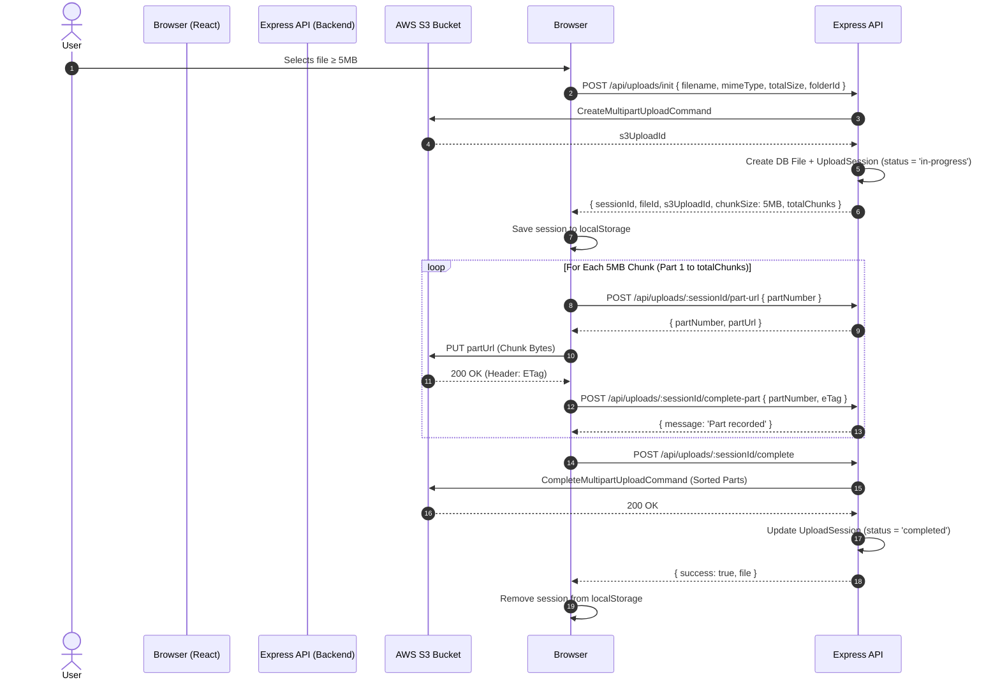

# Phase 3: Resumable & Chunked Large File Uploads Documentation

## Overview
This document details the architecture, 5MB chunking strategy, AWS S3 Multipart Upload API integration, local storage state persistence, resume reconciliation lifecycle, and design decisions implemented in Phase 3 of **CloudBox**.

---

## 1. Implemented Feature List

1. **Database Session Tracking**
   - **`UploadSession` Model**: `id` (UUID PK), `fileId` (FK → File), `userId` (FK → User), `s3UploadId` (string), `s3Key` (string), `totalChunks` (integer), `completedParts` (JSON array of `{ partNumber, eTag }`), `status` (`'in-progress'`, `'completed'`, `'aborted'`), `createdAt`, `updatedAt`.
   - **Sequelize Migration**: Created in `migrations/20260824000002-create-upload-sessions.js` with indexes on `userId` and `fileId`.

2. **AWS S3 Multipart Upload Integration**
   - Implemented using `@aws-sdk/client-s3` commands: `CreateMultipartUploadCommand`, `UploadPartCommand`, `CompleteMultipartUploadCommand`, and `AbortMultipartUploadCommand` in `s3.service.js`.
   - Reuses Phase 2 key-prefix format: `{userId}/{fileId}/{originalFilename}`.
   - Developer fallbacks for local dev environments where live AWS credentials have not been configured.

3. **Backend Multipart Endpoints**
   - `POST /api/uploads/init`: Accepts filename, mimeType, totalSize, folderId. Calculates chunk count, creates `File` DB record + `UploadSession` DB record, initiates S3 multipart upload, and returns `{ sessionId, fileId, s3UploadId, chunkSize, totalChunks }`.
   - `POST /api/uploads/:sessionId/part-url`: Generates a presigned `UploadPart` URL for part `partNumber`.
   - `POST /api/uploads/:sessionId/complete-part`: Appends completed `{ partNumber, eTag }` to the `UploadSession.completedParts` JSON array.
   - `POST /api/uploads/:sessionId/complete`: Calls S3 `CompleteMultipartUpload` with sorted parts, marks session status `'completed'`, and finalizes the `File` record.
   - `GET /api/uploads/:sessionId/status`: Returns current `completedParts` array and upload session status for client-side state reconciliation.
   - `POST /api/uploads/:sessionId/abort`: Calls S3 `AbortMultipartUpload`, marks session status `'aborted'`, and deletes the pending `File` DB record.

4. **Chunking Threshold & Branching**
   - **Threshold**: Set to 5MB (`5 * 1024 * 1024` bytes), matching AWS S3's minimum part size requirement.
   - **Files < 5MB**: Automatically use Phase 2's single-shot presigned PUT upload flow.
   - **Files $\ge$ 5MB**: Automatically route to Phase 3's resumable chunked multipart flow.

5. **Frontend Resumable Upload Flow & State Persistence**
   - Client-side chunk slicing using `file.slice(start, end)`.
   - Upload session state persisted in `localStorage` (`cloudbox_active_upload_sessions`) keyed by file fingerprint (`${filename}_${totalSize}_${folderId}`).
   - **Resume Banner**: On page load, if incomplete uploads exist in `localStorage`, a friendly, non-alarming prompt displays: *"Looks like an upload didn't finish — want to pick up where you left off?"*.
   - **State Reconciliation**: On resume, calling `GET /api/uploads/:sessionId/status` fetches already completed parts from the server/S3 and skips them, uploading only missing parts.
   - **Transient Fault Tolerance**: Automatic exponential backoff retries (up to 3 attempts) for transient chunk upload failures before surfacing an error state.
   - **UX & Progress UI**: Real-time progress bar showing actual byte counts (`42.3 MB of 120 MB`), percentage, and obvious Pause, Resume, and Cancel buttons. No raw S3 upload IDs, part numbers, or ETags are shown to end users.

---

## 2. Directory & File Structure Additions

```
CloudBox/
├── backend/
│   ├── src/
│   │   ├── models/
│   │   │   └── uploadSession.model.js       # UploadSession model definition
│   │   ├── migrations/
│   │   │   └── 20260824000002-create-upload-sessions.js # Session table migration
│   │   ├── validators/
│   │   │   └── upload.validator.js         # Zod schemas for multipart routes
│   │   ├── services/
│   │   │   ├── s3.service.js               # Updated with S3 Multipart API calls
│   │   │   └── upload.service.js           # Multipart upload business logic
│   │   ├── controllers/
│   │   │   └── upload.controller.js        # Multipart HTTP route handlers
│   │   └── routes/
│   │       └── upload.routes.js            # Express routes under /api/uploads
├── frontend/
│   ├── src/
│   │   ├── components/
│   │   │   ├── ResumeBanner.jsx            # Interrupted upload prompt banner
│   │   │   └── UploadModal.jsx             # Updated with chunked resumable UI & pause/resume
│   │   ├── utils/
│   │   │   └── chunkUploader.js            # Client chunking, retries, & localStorage state
│   │   └── pages/
│   │       └── DashboardPage.jsx           # Renders ResumeBanner & handles upload state
└── docs/
    └── phase3-resumable-uploads.md         # Standalone Phase 3 documentation
```

---

## 3. Step-by-Step Multipart Upload API Lifecycle



---

## 4. End-to-End Resume Reconciliation Architecture

1. **Local Storage Fingerprinting**:
   - Upload session metadata (`sessionId`, `filename`, `totalSize`, `folderId`) is saved under `cloudbox_active_upload_sessions` in `localStorage` keyed by `${filename}_${totalSize}_${folderId}`.

2. **Interruption Detection**:
   - On page load or Dashboard mount, React checks `localStorage`. If an active session exists, `<ResumeBanner>` alerts the user.

3. **Reconciliation**:
   - When the user selects the file and clicks **Resume Upload**, the client sends `GET /api/uploads/:sessionId/status`.
   - The backend returns the list of `completedParts` recorded in PostgreSQL/S3.
   - The client chunking loop compares part numbers against `completedParts`, **skips already uploaded chunks**, and only requests presigned URLs for missing parts.

---

## 5. Architectural & Design Rationale

1. **Zero Express Server Byte Proxying**:
   - Every chunk is transferred directly from the browser to AWS S3 using presigned part URLs. The Express server processes zero file bytes, preserving CPU, RAM, and network throughput.

2. **CORS Requirement for `ETag` Header**:
   - To record uploaded parts, the browser reads the `ETag` header returned by S3 in the PUT response. S3 bucket CORS must expose the `ETag` header (`ExposeHeaders: ["ETag"]`).

3. **Known Limitation (Stale Incomplete Upload Sessions)**:
   - If a user closes their browser mid-upload without clicking "Cancel", an incomplete multipart upload remains in AWS S3 and PostgreSQL (`status = 'in-progress'`).
   - *Recommendation*: AWS S3 Lifecycle Configuration should be set to automatically abort incomplete multipart uploads after 7 days (`AbortIncompleteMultipartUpload`).
